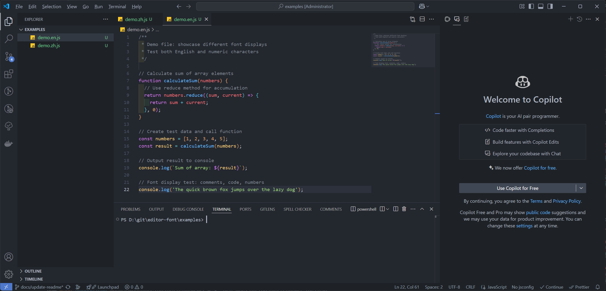
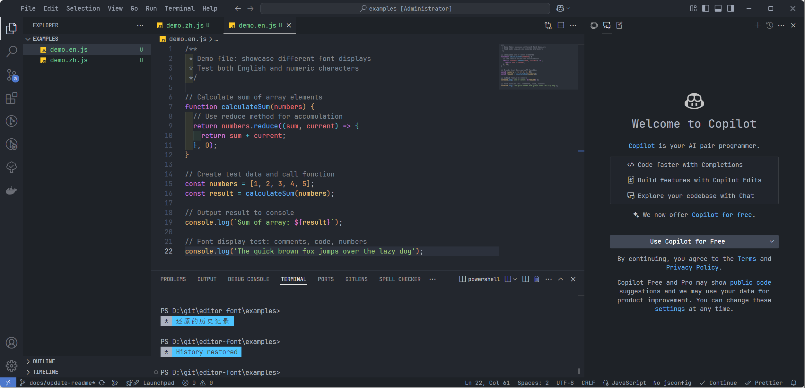

# Editor Font Customizer

English | [简体中文](README.zh.md)

A simple command-line tool for customizing editor fonts. Supports both English and Chinese interfaces with automatic system language detection.

## Preview

### Default Font



### After Customization



> Fonts used in example:
>
> - English: JetBrains Mono
> - Chinese: LXGW WenKai

> **Note**: Currently only supports Windows. macOS support coming soon.

## Features

- Support for Electron-based editors:
  - Visual Studio Code
  - Cursor
  - Trae
- Automatic editor installation path detection
- Custom font settings (multiple fonts supported)
- Default font restoration
- Bilingual interface (English/Chinese)
- User-friendly command-line interface

## Usage

1. Start the program:

   ```bash
   npm run start
   ```

2. Follow the prompts:
   - Select the editor to modify (VSCode/Cursor/Trae)
   - Choose operation type:
     - Modify custom font
     - Restore default font
   - If modifying font, enter font names (separate multiple fonts with commas)
   - Restart editor when prompted to apply changes

> **Tip**: When setting both English and Chinese fonts, it's recommended to input them in the order of "English font, Chinese font", e.g., `JetBrains Mono, LXGW WenKai`

## Operation Process

### Customize Font

1. The program automatically searches for editor installation path
2. If not found, you can manually input the installation path
3. Enter desired font names
4. Program creates necessary CSS configuration file
5. Restart editor to apply changes

### Restore Default Font

1. Select restore default font option
2. Program automatically removes custom CSS file
3. Restart editor to apply changes

## Important Notes

- Restart editor for changes to take effect
- Ensure font names are correct and installed on your system
- Backup original configuration before making changes
- This tool currently only works on Windows systems
- Due to inconsistent style inheritance in some editors, multiple element styles may need to be customized. We provide template files for each supported editor in the `templates` directory. Community contributions to improve these style templates and support more editor elements are highly appreciated.
- After modifying fonts, you may see a warning message saying "Installation appears to be corrupt" when opening the editor. This is because the custom CSS modification affects VS Code's file integrity check (SHA-256 checksums). This warning is expected and **does not affect the editor's functionality** - you can safely ignore it or click "Don't Show Again".
- **Important**: This tool modifies the editor interface fonts (like file tree, menus, titles, etc.). To change the font in the editor area (code area), you still need to manually modify the `Editor: Font Family` option in your editor settings.

## Language Support

The tool automatically detects system language and switches interface:

- English (default)
- Chinese (switches automatically when system language is Chinese)

## System Requirements

- Windows 7 or later
- Node.js 12 or later
- Editor installed on your system

## License

This project is licensed under the MIT License - see the [LICENSE](LICENSE) file for details

## Feedback

If you encounter any issues or have suggestions for improvements, please raise them in GitHub Issues.
